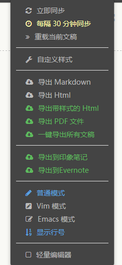

[ Gerrit 使用指南 ](http://zhairis4-w7/ "点我开始体验")


#Gerrit 简明手册

标签：arp gerrit

```
 s
 ====================
--- s
```

```
这是一个一级标题
============================

这是一个二级标题
--------------------------------------------------

### 这是一个三级标题
```



asd
<!DOCTYPE html>
<html lang="en">
<head>
    <meta charset="UTF-8">
    <link href="http://cdn.bootcss.com/bootstrap/4.0.0-alpha.3/css/bootstrap.css" rel="stylesheet">
    <link rel="stylesheet" href="">
    <title>Title</title>
</head>
<body>
<button class= 'btn btn-large btn-warning'>点我</button>
</body>
</html>
   